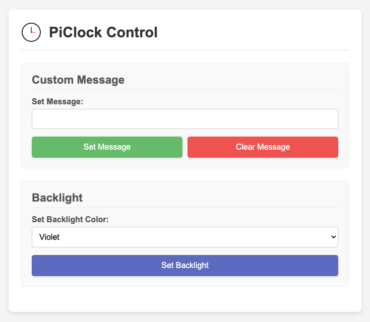

# 🕰️ PiClock Control

A minimalist touchscreen and web-controlled information clock for Raspberry Pi with an Adafruit Character LCD Plate. Designed for household use (e.g. “Wife Edition”) and inspired by embedded systems UI simplicity.

---

## ✨ Features

- ⌚ Displays time and date on a 16x2 LCD
- 🌤️ Shows local weather (Open-Meteo API)
- 📝 Custom message display (e.g. reminders, greetings)
- 💡 Backlight color selection via physical buttons or web interface
- 🌐 Simple Flask-based web UI for remote control
- 📁 Local file-based state persistence
- 🔁 Runs persistently with systemd

---

## 📸 Screenshot

>   
> *(Include this after deployment, or link to hosted image)*

---

## 📦 Requirements

- Raspberry Pi with Python 3
- [Adafruit_CharLCDPlate](https://github.com/adafruit/Adafruit_Python_CharLCD)
- Flask
- Requests

Install dependencies:

```bash
pip install flask requests
````

---

## 📂 Project Structure

```
/opt/piclock/
├── main.py               # Main clock loop
├── web_control.py        # Flask-based web controller
├── backlight.txt         # Persisted color state
├── msg.txt               # Optional user message
├── location.txt          # Location string for weather
├── weather_cache.json    # 1-hour weather cache
├── static/
│   └── style.css         # Web UI styles
├── templates/
│   └── index.html        # Web UI layout
```

---

## 🚀 Usage

### Start the clock

```bash
python3 main.py
```

### Start the web UI

```bash
python3 web_control.py
```

### Systemd (example)

Create `/etc/systemd/system/piclock.service`:

```ini
[Unit]
Description=PiClock Service
After=network.target

[Service]
ExecStart=/opt/piclock/start_all.sh
WorkingDirectory=/opt/piclock
StandardOutput=inherit
StandardError=inherit
Restart=on-failure
User=pi
Environment=PYTHONUNBUFFERED=1

[Install]
WantedBy=multi-user.target
```

---

## 🌐 Web Interface

Access via:

```
http://<your-pi-ip>:8080
```

* Set or clear the custom display message
* Select a backlight color
* Changes persist across reboots

---

## ⚙️ Configuration

* **Message file**: `/opt/piclock/msg.txt`
* **Color file**: `/opt/piclock/backlight.txt`
* **Weather**: Automatically geocoded from `/opt/piclock/location.txt`

---

## 🧰 Customization Ideas

* Live ambient sensor display (temperature, CO₂, etc)
* Scheduled messages via cron
* OTA updates using Git
* Light/dark mode switch for web UI
* PiCamera snapshot and upload panel

---

## 📜 License

MIT License. See [LICENSE](LICENSE) for details.
